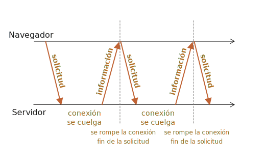

# Sondeo largo

El "sondeo largo" es la forma más sencilla de tener una conexión persistente con el servidor, pues no utiliza ningún protocolo específico como "WebSocket" o "SSE" (en español, Eventos enviados por el servidor).

Es muy fácil de implementar, y también suficientemente bueno en muchos casos.

## Sondeo regular

La forma más sencilla de obtener información nueva desde el servidor es un sondeo periódico. Es decir, solicitudes regulares al servidor: "Hola, estoy aquí, ¿tienes información para mí?". Por ejemplo, una vez cada 10 segundos.

En respuesta, el servidor: primero, se da cuenta de que el cliente está en línea; segundo, envía un paquete de mensajes que recibió hasta ese momento.

Esto funciona, pero tiene desventajas:
1. Los mensajes desde el servidor se transmiten con un retraso de hasta 10 segundos (el lapso entre solicitudes).
2. Incluso si no hay mensajes, el servidor es bombardeado con solicitudes cada 10 segundos; aunque el usuario haya cambiado a otro lugar, o esté dormido. En términos de rendimiento, esto es bastante difícil de manejar.

Entonces, si hablamos de un servicio muy pequeño, el enfoque puede ser viable; pero en general, se necesita algo mejor.

## Sondeo largo

El llamado "sondeo largo" es una forma mucho mejor de sondear el servidor.

También es muy fácil de implementar, y envía los mensajes sin demoras.

El flujo es:

1. El navegador envía una solicitud al servidor.
2. El servidor no cierra la conexión mientras no tenga mensajes para enviar.
3. Cuando aparece un mensaje, el servidor responde a la solicitud con él.
4. El navegador recibe el mensaje y de inmediato realiza una nueva solicitud.

Esta situación, en la que el navegador envió una solicitud y tiene una conexión pendiente con el servidor, es estándar para este método. Solo cuando se entrega un mensaje, se restablece la conexión.



Si se pierde la conexión (por ejemplo, debido a un error de red), el navegador envía inmediatamente una nueva solicitud.

Este es un esquema, del lado del cliente, de la función de suscripción que realiza solicitudes largas:

```js
async function subscribe() {
  let response = await fetch("/subscribe");

  if (response.status == 502) {
    // El estado 502 es un error de "tiempo de espera agotado" en la conexión,
    // puede suceder cuando la conexión estuvo pendiente durante demasiado tiempo,
    // y el servidor remoto o un proxy la cerró
    // vamos a reconectarnos
    await subscribe();
  } else if (response.status != 200) {
    // Un error : vamos a mostrarlo
    showMessage(response.statusText);
    // Vuelve a conectar en un segundo
    await new Promise(resolve => setTimeout(resolve, 1000));
    await subscribe();
  } else {
    // Recibe y muestra el mensaje
    let message = await response.text();
    showMessage(message);
    // Llama a subscribe () nuevamente para obtener el siguiente mensaje
    await subscribe();
  }
}

subscribe();
```

Como puedes ver, la función `subscribe` realiza una búsqueda, luego espera la respuesta, la maneja y se llama a sí misma nuevamente.

```warn header="El servidor debe ser capaz de mantener muchas conexiones pendientes"
La arquitectura del servidor debe poder funcionar bien con muchas conexiones pendientes.

Algunas arquitecturas de servidor ejecutan un proceso por conexión, resultando en que habrá tantos procesos como conexiones, y cada proceso requiere bastante memoria. Demasiadas conexiones la consumirán toda.

Este suele ser el caso de los backends escritos en lenguajes como PHP y Ruby.

Los servidores escritos con Node.js generalmente no tienen este problemas.

Dicho esto, no es un problema del lenguaje sino de implementación. La mayoría de los lenguajes modernos, incluyendo PHP y Ruby, permiten la implementación de un backend adecuado. Por favor asegúrate de que la arquitectura del servidor funcione bien con múltiples conexiones simultáneas.
```

## Demostración: un chat

Aquí está la demo de un chat, que también puedes descargar y ejecutar localmente (si estás familiarizado con Node.js y puedes instalar módulos):

[codetabs src="longpoll" height=500]

El código del navegador está en `browser.js`.

## Área de uso

El sondeo largo funciona muy bien en situaciones en las que los mensajes son escasos.

Pero si los mensajes llegan con mucha frecuencia, el gráfico de mensajes solicitados/recibidos se vuelve en forma de diente de sierra.

Cada mensaje es una solicitud separada; provista de encabezados, sobrecarga de autenticación, etc.

Entonces, en este caso, se prefieren otros métodos, como [Websocket](info:websocket) o [SSE, Eventos enviados por el servidor](info:server-sent-events).
